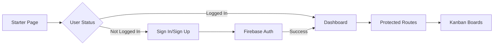

# 📌 KanbanFlow

> A modern, full-featured Project Management Tool built with React, Firebase, and drag-and-drop capabilities.

KanbanFlow is a sleek, dark-themed Kanban board application that helps teams and individuals organize tasks visually. Inspired by Trello and Asana, it offers intuitive task management with powerful features like real-time collaboration and smooth drag-and-drop interactions.


---

## ✨ Features

### 🔐 **Authentication & Security**

- Firebase Authentication with Email/Password
- Protected routes with authentication guards
- Secure user sessions and automatic logout
- Personalized user dashboards

### 📋 **Kanban Board Management**

- Visual task organization (To-Do, In Progress, Done)
- Smooth drag-and-drop functionality with **@dnd-kit**
- Create, edit, and delete tasks seamlessly
- Multiple board support per user
- Real-time task updates

### 🎨 **Modern UI/UX**

- Beautiful dark theme interface
- Fully responsive design (mobile, tablet, desktop)
- Clean and intuitive user experience
- React Icons for consistent iconography
- TailwindCSS v4 for modern styling

### ⚡ **Performance & Developer Experience**

- Lightning-fast Vite build tool
- Optimized React 19 features
- ESLint configuration for code quality
- Hot module replacement (HMR)

---

## 🛠️ Tech Stack

| Category                     | Technology                           |
| ---------------------------- | ------------------------------------ |
| **Frontend Framework**       | React 19.1.1 with Vite               |
| **Routing**                  | React Router DOM v7                  |
| **Styling**                  | TailwindCSS v4 with Vite plugin      |
| **Drag & Drop**              | @dnd-kit (core, sortable, modifiers) |
| **Authentication & Backend** | Firebase 12.3.0 (Auth, Firestore)    |
| **State Management**         | React Context API                    |
| **Icons**                    | React Icons                          |
| **Utilities**                | UUID for unique identifiers          |
| **Development**              | Vite, ESLint                         |
| **Deployment**               | Netlify                              |

---

## 🚀 Getting Started

### Prerequisites

- Node.js (v16 or higher)
- npm or yarn
- Firebase account

### Installation

1. **Clone the repository**

   ```bash
   git clone https://github.com/utkarsh032/KanbanFlow.git
   cd KanbanFlow
   ```

2. **Install dependencies**

   ```bash
   npm install
   ```

3. **Configure Firebase**

   - Go to [Firebase Console](https://console.firebase.google.com/)
   - Create a new project
   - Enable **Authentication** → Email/Password provider
   - Enable **Firestore Database** (for task storage)
   - Copy your Firebase configuration

4. **Create Firebase config file**

   Create `src/firebase.js` and add your configuration:

   ```javascript
   import { initializeApp } from 'firebase/app'
   import { getAuth } from 'firebase/auth'
   import { getFirestore } from 'firebase/firestore'

   const firebaseConfig = {
     apiKey: 'YOUR_API_KEY',
     authDomain: 'YOUR_PROJECT_ID.firebaseapp.com',
     projectId: 'YOUR_PROJECT_ID',
     storageBucket: 'YOUR_PROJECT_ID.appspot.com',
     messagingSenderId: 'YOUR_SENDER_ID',
     appId: 'YOUR_APP_ID'
   }

   export const app = initializeApp(firebaseConfig)
   export const auth = getAuth(app)
   export const db = getFirestore(app)
   ```

5. **Run the development server**

   ```bash
   npm run dev
   ```

6. **Open your browser**

   Navigate to `http://localhost:5173/`

---

## 🔑 Authentication Flow



1. **Sign Up** → Create a new account with email/password
2. **Sign In** → Authenticate with existing credentials
3. **Protected Routes** → Dashboard access only for authenticated users
4. **Logout** → Clear session and redirect to starter page

---

## 🎯 Core Functionality

### Drag & Drop System

Built with **@dnd-kit** for smooth, accessible drag-and-drop:

- Drag tasks between columns (To-Do → In Progress → Done)
- Reorder tasks within the same column
- Touch-friendly for mobile devices
- Keyboard navigation support

### Task Management

- ✅ Create new tasks with titles and descriptions
- ✅ Edit existing tasks inline
- ✅ Delete tasks with confirmation
- ✅ Move tasks across different board states
- ✅ Real-time synchronization with Firebase

---

## 📜 Available Scripts

```bash
# Start development server
npm run dev

# Build for production
npm run build

# Preview production build
npm run preview

# Lint code
npm run lint
```

---

## 🌟 Upcoming Features

- [ ] **Collaborative Boards** - Invite team members to boards
- [ ] **Task Comments** - Add discussions to tasks
- [ ] **Due Dates & Reminders** - Set deadlines with notifications
- [ ] **Labels & Tags** - Categorize tasks with custom labels
- [ ] **File Attachments** - Upload images and documents to tasks
- [ ] **Activity Log** - Track changes and updates
- [ ] **Dark/Light Theme Toggle** - User preference support
- [ ] **Export Boards** - Download boards as JSON/PDF
- [ ] **Search & Filter** - Advanced task search functionality
- [ ] **Archived Tasks** - Move completed tasks to archive

---

## 📸 Screenshots

<!-- Add your screenshots here -->
<!-- Example:


-->

_Screenshots coming soon!_

---

## 🤝 Contributing

Contributions are what make the open-source community amazing! Any contributions you make are **greatly appreciated**.

1. Fork the Project
2. Create your Feature Branch (`git checkout -b feature/AmazingFeature`)
3. Commit your Changes (`git commit -m 'Add some AmazingFeature'`)
4. Push to the Branch (`git push origin feature/AmazingFeature`)
5. Open a Pull Request

Please make sure to update tests as appropriate and follow the existing code style.

---

## 🐛 Bug Reports & Feature Requests

Found a bug or have a feature idea? Please open an issue on GitHub with detailed information:

- Bug reports: Include steps to reproduce, expected behavior, and screenshots
- Feature requests: Describe the feature and its use case

---

## 📄 License

This project is licensed under the MIT License - see the [LICENSE](LICENSE) file for details.

---

## 🙏 Acknowledgments

- [React](https://react.dev/) - UI library
- [Firebase](https://firebase.google.com/) - Backend and authentication
- [dnd-kit](https://dndkit.com/) - Drag and drop functionality
- [TailwindCSS](https://tailwindcss.com/) - Styling framework
- [Vite](https://vite.dev/) - Build tool
- [React Icons](https://react-icons.github.io/react-icons/) - Icon library

---

## 📧 Contact

**Your Name** - [@your_twitter](https://twitter.com/your_twitter)

**Project Link:** [https://github.com/your-username/KanbanFlow](https://github.com/your-username/KanbanFlow)

**Live Demo:** [https://kanbanflow.vercel.app](https://kanbanflow.vercel.app)

---

<div align="center">
  <p>Built with ❤️ using React and Firebase</p>
  <p>⭐ Star this repo if you find it helpful!</p>
</div>
